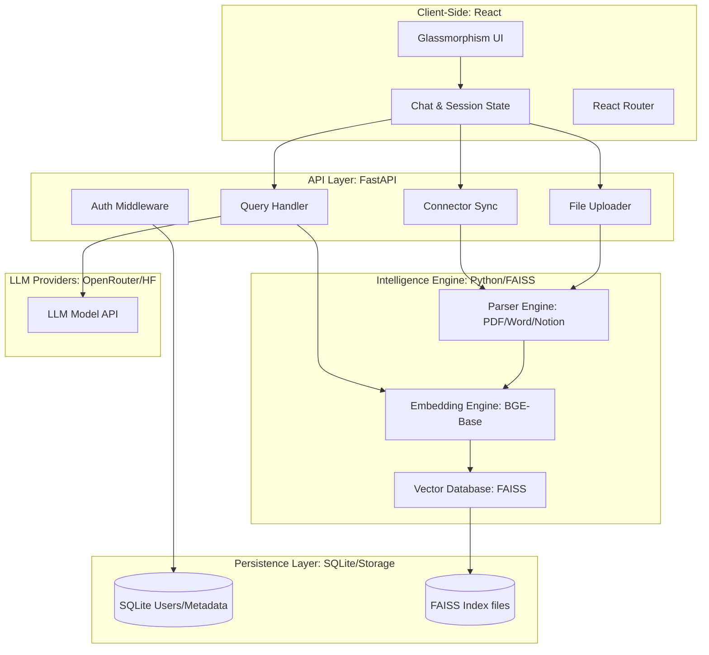
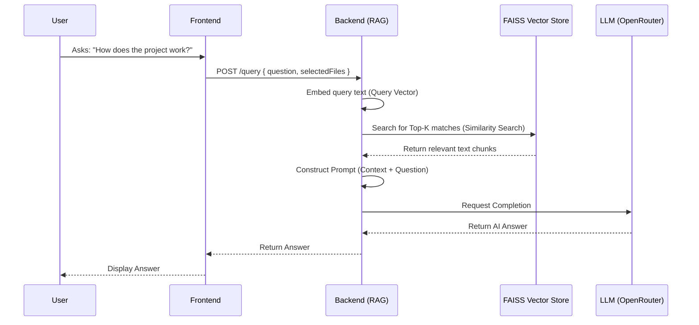

# NexusRAG Architecture & Workflow Documentation

This document provides a deep-dive into the internal architecture, data flows, and system logic of NexusRAG.

---

## 🏗️ System Architecture

NexusRAG follows a modern, decoupled client-server architecture. The frontend is a single-page application (SPA) focused on UX/UI, while the backend serves as a high-performance RAG pipeline.

---

## 🔄 Core Workflows

### 1. Document Ingestion Workflow
When a user uploads a document or syncs a Notion page, the following sequence occurs:

1.  **Ingestion**: Frontend sends data/token to `/upload` or `/sync/notion-page`.
2.  **Extraction**: The `Parser Engine` extracts clean text content.
3.  **Embedding**: `SentenceTransformer` converts text into high-dimensional vectors (768 dimensions).
4.  **Indexing**: Vectors are added to the `FAISS` index in memory.
5.  **Persistence**: The backend saves the updated `.faiss` and `.pkl` files for instant recovery on restart.

---

### 2. RAG Query Workflow
When a user asks a question, NexusRAG performs a sophisticated retrieval-augmented response generation:

---

## 📊 Data Models

### 1. User Entity (SQLite)
*   **Id**: Primary Key.
*   **Username**: Unique string.
*   **Password Hash**: Bcrypt-stored secret.
*   **Role**: 'User' or 'Admin'.

### 2. DocumentStore Memory (FAISS)
*   **Vector Index**: In-memory optimized search structure.
*   **metadata.pkl**: Maps vector IDs to original text and source metadata (filename, sync source, timestamp).

---

## 🛡️ Security Architecture
*   **Frontend**: All communication is done over secure HTTP with stateful authentication checking.
*   **Backend**: 
    - LLM API keys are never exposed to the frontend; all logic is server-side.
    - CORS is configured for specific local development origins.
    - Password security is handled via Python's `bcrypt` and `passlib`.

---

Created with ✨ by **DeepMind Advanced Agentic Coding Team**.
