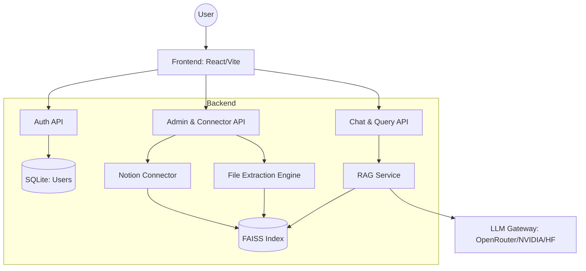

# NexusRAG: Ultimate Knowledge Management Platform

NexusRAG is a premium, open-source Retrieval-Augmented Generation (RAG) platform designed to turn your private documents and workspace content into a searchable, interactive intelligence hub. With a stunning glassmorphism interface and multi-source connector support, NexusRAG is the ultimate tool for developers, teams, and data analysts.

---

## 🎨 Design Philosophy
*   **Rich Aesthetics**: A modern, vibrant glassmorphism UI that feels alive and premium.
*   **Dynamic Design**: Subtle micro-animations and hover effects to guide user interaction.
*   **A-State-Of-The-Art Experience**: Powered by the latest LLMs via OpenRouter, NVIDIA NIM, and Hugging Face.

---

## 🚀 Key Features
*   **Universal Document Support**: Index and search through PDF, DOCX, TXT, and Markdown files.
*   **Cloud Connectors**: Seamless, direct synchronization with **Notion** workspaces for real-time knowledge ingestion.
*   **Vector Database (FAISS)**: Blazing fast high-dimensional search using local FAISS vector stores for maximum privacy.
*   **Sleek Chat Interface**: Intuitive chat history, multi-document selection for selective context, and smart AI responses.
*   **Advanced Embedding**: Powered by `BGE-Base-En-v1.5` for industry-leading retrieval accuracy.
*   **Role-Based Access**: Secure login system with an Admin portal for system-level data management.

---

## 🏗️ Architecture Overview



---

## 🛠️ Tech Stack
*   **Frontend**: React 18, Vite, React Router, Vanilla CSS (Glassmorphism).
*   **Backend**: Python 3.10+, FastAPI, SQLAlchemy.
*   **AI/ML**: `sentence-transformers`, `faiss-cpu`, `notion-client`.
*   **Storage**: SQLite (Metadata), `faiss_index` (Vectors).

---

## 📜 Repository Structure
*   [/frontend](file:///c:/madhu/frontend): Modern React dashboard and chat interface.
*   [/backend](file:///c:/madhu/backend): FastAPI server handling the RAG pipeline and integrations.
*   [ARCHITECTURE.md](file:///c:/madhu/ARCHITECTURE.md): Detailed workflow, diagrams, and system flowcharts.

---

## 🏁 Getting Started

### 1. Prerequisites
*   Node.js v16+
*   Python 3.10+
*   Notion Integration Token (Internal)

### 2. Configuration
Create a `.env` file in the `backend/` directory from the template provided (see backend README).

### 3. Launching
**Backend:**
```bash
cd backend
python -m venv .venv
source .venv/bin/activate  # or .venv\Scripts\activate on Windows
pip install -r requirements.txt
python run.py
```

**Frontend:**
```bash
cd frontend
npm install
npm run dev
```

---

## ⚖️ License
MIT License - See the [LICENSE](file:///c:/madhu/LICENSE) for more details.

---

Created with ✨ by **DeepMind Advanced Agentic Coding Team**.
